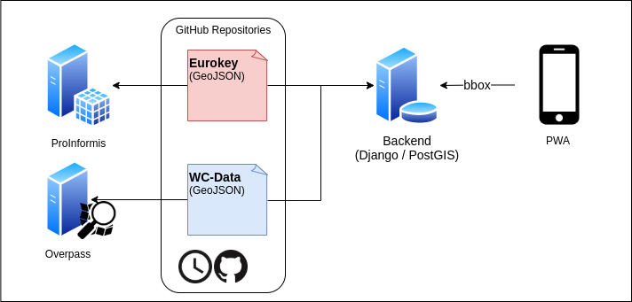

# wc-guide-backend

## Development
### Prerequisites
To start development make sure the following applications are installed:
 - Docker (https://docs.docker.com/get-docker/)
 - Poetry (https://python-poetry.org/docs/)
 - GDAL (https://gdal.org/)
### Setup

#### Database
Run PostgreSQL Database with PostGIS extension.
```sh
docker run --name wc-guide-backend-db -e POSTGRES_DB=wc-guide-backend-db -e POSTGRES_USER=guide -e POSTGRES_PASSWORD=wc-guide-backend -d -p 5432:5432 mdillon/postgis
```
#### Backend
Run Django Backend.
```sh
poetry install
poetry run python manage.py migrate
poetry run python manage.py runserver
```
Now you can navigate to http://localhost:8000/swagger/ to get the API documentation.

### Testing
To run the test locally execute the following command:
```sh
 poetry run pytest -v -s
```
Further, there is a GitHub Action that executes the tests on over push to main and pull request.
[GitHub Action Testing](.github/workflow/testing.yml)


### Examples

### Stored Data

If you want to query all toilets within a certain bounding box, you can do the following request:
```sh
curl http://localhost:8000/toilets/?in_bbox=9.283283,47.081593,9.372739,47.133249
```
The `in_box` has to be ordered as follows min Lon (west), min Lat (south), max Lon (east) and max Lat (north).

### Overpass

If you want to query all toilets within a certain bounding box, you can do the following request:
```sh
curl http://localhost:8000/overpass/?in_bbox=9.283283,47.081593,9.372739,47.133249
```
The `in_box` has to be ordered as follows min Lon (west), min Lat (south), max Lon (east) and max Lat (north).


## Deployment
The wc-guide-backend is running on an instance for [Scaleway](https://www.scaleway.com/en/).

The instance can be reached via ssh (requires certificate):
```sh
ssh root@51.15.121.145
```

Further, on the Scaleway instance is [Dokku](https://dokku.com/) installed to enable continuous deployment.

### Setup
Dokku setup that has to be done as prerequisite.

#### Dokku Server
PostgreSQL Database:
```sh
docker run --name wc-guide-backend-db -e POSTGRES_DB=wc-guide-backend-db -e POSTGRES_USER=guide -e POSTGRES_PASSWORD=wc-guide-backend -d -p 5432:5432 mdillon/postgis
```

wc-guide-backend:
```sh
dokku apps:create wc-guide-backend
dokku config:set wc-guide-backend DJANGO_DEBUG=False DJANGO_SECRET_KEY=Pcp2FV9Ad1dbFSNhJXFAGZ2tsH0vCpQCnPLfFXVRq04bL0y05VrzrbfPxV9nl5gSEJmzIkelMye0PIvlR6TKk9GdavARmj0YTqGP
```

#### Local Machine (GitHub) 
To deploy the wc-guide-backend you have to add the remote repository.
```sh
git remote add dokku dokku@51.15.121.145:wc-guide-backend
```
Afterwards you are able to deploy / push your changes to the server.
```sh
git push dokku main
```
